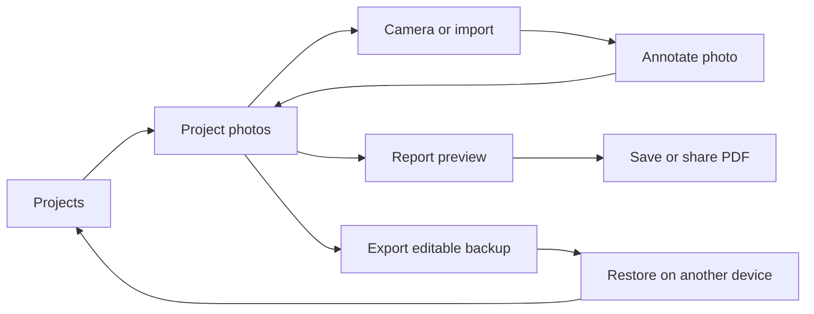

# Measurement Photo Notebook — build blueprint

Blueprint: 18 September 2026 · Status updated 19 September: M1 implemented locally as a hidden prototype. See the
[implementation and validation notes](../tools/measurement-notebook/README.md).
The blueprint below retains the planned later milestones. M1 uses a raster PDF page to
preserve rendered labels; vector text/font embedding is still deferred. Real-device checks
and the competitor/user trial remain outstanding.

## Product and first user

**Take a photo, record dimensions on it, and leave with a clear measurement sheet.**

The first user is a DIYer or small trade measuring windows, furniture or fittings. Their
current workaround is a camera roll plus notes whose measurements are hard to match back to
the right object. Our initial job is to keep those together and make the result easy to send.

Example: create “Kitchen windows”, photograph three windows, label each width and height,
add “inside recess”, then export a three-page PDF for a supplier. Return later and change a
measurement without starting over.

Working name: **Measurement Notebook**. Proposed web slug: `measurement-notebook`.
Name and store availability have not been checked. Keep it under Plenty of Tools initially.

Core promise: usable exports are free, photos are processed locally, no account is required.
Measurements are entered by the user. This version does not infer real dimensions from pixels.

Our research found free alternatives, so preference for this workflow remains unproven.
The intended difference is the combination of quick annotation, reusable local projects and
good reports. See the [research addendum](../../idea-engine/APP_OPPORTUNITIES.md) for competitor
restrictions and qualifications.

## Scope and sequence

| Stage | Deliverable | Boundary |
|---|---|---|
| 1. Working prototype | One photo → editable labels → image/PDF export | Local preview, memory-based editing; no claim that work survives closing |
| 2. Usable web beta | Multiple projects/photos, autosave, backup/restore, offline reload | Phone-friendly web tool on the existing site |
| 3. Native pilot | Camera/import, durable local projects, system sharing | iPhone and Android architecture; first test platform follows available hardware/users |
| 4. Report extension | Before/after pairs, room sections and report templates | Only after people use the measurement workflow |

The web prototype is a short route to testing the interaction. Native is an explicit milestone
with its own device testing, not an indefinite “maybe later” or a promise that wrapping HTML
alone produces a good app.

Initial scope includes dimension arrows, text notes, selection/edit/delete, undo/redo, zoom/pan,
metric and imperial labels, editable project files, annotated image export and multi-page PDFs.

Deferred: automatic measurement, LiDAR, perspective calibration, Bluetooth laser meters,
floor-plan drawing, accounts, team sync, OCR and subscriptions. Each adds work outside the
first user's photo-to-sheet task. Before/after reporting is the first proposed extension.

## Screens and main flow



**Projects:** title, last edited, photo count, New project and Import backup. Empty state offers
“Try an example” without camera permission. Beta projects show a save state, not a cloud icon.

**Project:** editable name; ordered photo cards with captions; Add photo; Export report;
Backup project. Reordering changes report order. Deleting a photo offers undo during the
session; deleting a whole project requires confirmation.

**Editor:** photo takes most of the screen. Back, photo title and save state above it; Select,
Dimension, Note, Undo and Redo in a bottom toolbar. Selecting an annotation opens a compact
inspector. No permanent sidebar on narrow phones.

```text
┌──────────────────────────────────┐
│ ‹ Kitchen windows       Saved    │
│ Window above sink                │
│                                  │
│       ←──── 1200 mm ────→         │
│       [      photo      ]        │
│       [                 ]  ↑     │
│       [                 ] 900 mm │
│                            ↓     │
│                                  │
│ Select   Dimension   Note   ↶ ↷  │
├──────────────────────────────────┤
│ Value [1200] Unit [mm ▾]         │
│ Note [inside recess          ]   │
│ Colour ● ● ●     Delete   Done  │
└──────────────────────────────────┘
```

**Report preview:** project title, selected photos, order, captions, A4/Letter and portrait/
landscape controls. One photo per page initially. Download PDF is the primary action; image
export is available from the photo editor. A report is a shareable result, while a project
backup is what allows future editing.

Design direction: use the site's existing typography and controls around a quiet, neutral
editor. High-contrast labels have solid backgrounds so they remain readable on busy photos.
Colour indicates selection but is not the only selection cue. No splash screen before a task.

## Editing behaviour to settle before coding

- **Create a dimension:** choose Dimension, tap a start point and an end point, then enter the
  value and unit. Show a provisional line after the first tap; Escape/Cancel discards it.
  Tap-tap placement is the baseline for both mouse and touch.
- **Select:** tap a line, label or note. Use generous screen-space hit areas, independent of
  zoom. Drag handles to move endpoints; drag the label to move its offset without changing
  the endpoints. Make selecting a thin line forgiving.
- **Pan/zoom:** two-finger gestures on touch; wheel zoom and explicit Pan mode on desktop.
  A second finger cancels any provisional annotation. Handle pointer cancellation so it
  cannot leave a stuck drag or save half a command. Include Fit photo and zoom buttons.
- **Values:** store typed numeric text separately from units. Support decimal metric values
  and common inch fractions such as `3 1/2`. Validate the input; do not silently reinterpret
  it. Changing units changes the suffix only in v1, with clear wording. No automatic conversion.
- **Notes:** separate free text for descriptions such as “clear opening”. Wrap long text and
  show the complete value in export; never silently truncate a measurement.
- **History:** one undo step per completed edit or drag, scoped to the open photo. Switching
  photos begins a fresh history. Persist the resulting document, not the undo stack, in v1.
- **Accessibility:** labelled controls, visible focus, minimum 44px touch targets, keyboard
  deletion/undo and arrow-key nudging. Provide an annotation list with editable values and
  endpoint position controls so drag gestures are not the only editing route.

## Data, storage and export contract

Use a versioned document model that has no DOM, browser-storage or native-library dependencies.
The web and native interfaces share its validation, units, geometry and migration behaviour.

```json
{
  "schemaVersion": 1,
  "project": {
    "id": "project-id",
    "title": "Kitchen windows",
    "createdAt": "2026-09-18T09:00:00Z",
    "updatedAt": "2026-09-18T09:00:00Z",
    "photoOrder": ["photo-id"],
    "page": {"size": "A4", "orientation": "portrait"}
  },
  "photos": [{
    "id": "photo-id",
    "originalAssetId": "asset-original",
    "displayAssetId": "asset-oriented",
    "width": 4032,
    "height": 3024,
    "caption": "Window above sink",
    "annotations": [{
      "id": "annotation-id",
      "type": "dimension",
      "start": {"x": 0.15, "y": 0.25},
      "end": {"x": 0.75, "y": 0.25},
      "labelOffset": {"x": 0, "y": -0.03},
      "valueText": "1200",
      "unit": "mm",
      "note": "inside recess",
      "style": {"colour": "#165DCC", "size": "normal"}
    }]
  }]
}
```

This illustrates the persisted model, not an executable schema. The first implementation
must define a JSON Schema or equivalent strict validator, including the separate text-note
variant, asset manifest and supported field bounds.

**Geometry:** x and y are fractions of the oriented photo's width and height, not viewport
coordinates. Store label offsets in that same space. Zoom and pan are view state; resizing
the viewport must not change annotations. Keep coordinates bounded to the image. Centralise
image-to-view and image-to-export transforms. Both renderers consume a shared draw plan.

**Photos:** preserve the source bytes and keep orientation-correct dimensions for the display
asset. Generate thumbnails; do not decode every full-size photo while listing a project.
Prototype input: JPEG/PNG/WebP. Test what real phone camera/file pickers return. For HEIC,
evaluate the existing converter's separately licensed decoder before adding support; until
supported, show a useful format error and leave the rest of the project intact. Avoid copying
that dependency without its notices.

**Persistence:** IndexedDB for web metadata and image blobs, in a database named for this tool.
Save completed edits promptly and show “Saved” only after transaction success. If a write fails,
show “Not saved — export a backup” while retaining the working state. Imports and restores
commit complete assets and metadata atomically; a failed operation must preserve old projects.

Browser storage is best-effort unless persistence is granted, and users can still clear it.
Request persistence where supported and provide an editable backup. This is why “saved on
this device” must not be presented as guaranteed backup.
[Browser storage behaviour](https://developer.mozilla.org/en-US/docs/Web/API/Storage_API/Storage_quotas_and_eviction_criteria).

**Editable backup:** a ZIP containing `manifest.json`, the versioned project document and
referenced assets. Restore as a new project with remapped IDs; never overwrite an existing
project by default. Validate archive paths, types, dimensions, schema and expanded size before
commit. A newer unsupported schema gets an actionable error, not partial import. The backup
includes source photos and their original metadata; label that clearly in the export UI.

**Image export:** render an orientation-correct annotated PNG/JPEG with no added location
metadata and no watermark. Target full decoded resolution where supported; offer a clearly
labelled smaller export when the device cannot handle it. The source photo remains unchanged.

**PDF:** compose the image and annotation draw plan using the existing vendored `pdf-lib`
where suitable. Embed a licensed font with the required symbol coverage; test `½`, `°`, inch
marks and non-English captions. Default to one image per page, with project title, caption,
page number and a small “Dimensions entered by user” note. Handle aspect ratios and caption
overflow deliberately. The photograph is fitted to a page, not printed at a physical scale.

Start performance tests with a 12-megapixel photo, ten annotations, and a ten-photo report.
Export pages sequentially, release decoded buffers and show progress/cancel. Define supported
file/pixel/archive limits from device tests, describe them as device limits, and never impose
an artificial five-annotation export cap. Avoid promising unlimited storage.

## Technical implementation

### Web prototype and beta

Match the current static-site approach: plain JavaScript, HTML/CSS and an SVG editor overlay.
Use Pointer Events for interaction and canvas only where raster output is needed. Keep
document logic in a small module that also runs in the repository's Node test convention.
Vendor runtime assets rather than depend on CDN availability.

Proposed files, created during implementation:

```text
tools/measurement-notebook/
  meta.json
  index.html
  tool.css
  app.js                     UI and interaction wiring
  static/
    core.js                  document commands, geometry, validation
    storage.js               IndexedDB adapter
    export.js                shared draw plan, image/PDF/backup export
    sample-window.jpg        own/licensed example asset
    manifest.webmanifest
    [fonts and notices]
  service-worker.js          copied beside the generated tool route
  vendor/                    reviewed PDF/ZIP runtime dependencies
  README.md
tests/
  measurement-notebook.test.cjs
  measurement-notebook.browser.cjs
```

The build already copies `static/` and `vendor/`. Load static modules explicitly from their
generated paths; it does not auto-load them. Add a registry entry with `status: hidden` for the
prototype, so it builds at `/tools/measurement-notebook/` without appearing on the homepage.
Use narrow patches and retain the current site shell.

For the offline beta, add a small build hook that copies this tool's service worker beside
its generated `index.html`. Register it with scope `/tools/measurement-notebook/`; placing it
under `/assets/` alone would give the wrong default scope. Cache the tool page, its shell
resources, fonts and dependencies, not other tools or private project blobs. Project photos
remain in IndexedDB. Show “Ready offline” only after required assets are cached. Test a cold
offline reload after the first successful visit, not just continued use of an already open tab.
[Service worker registration and scope](https://developer.mozilla.org/en-US/docs/Web/API/ServiceWorkerContainer/register).

### Native pilot

Provisional choice: React Native with Expo, with TypeScript for native application code.
Reuse the document format, tested geometry and validation; build a native interface and native
storage/share adapters. Do not assume the browser editor or PDF renderer transfers unchanged.

The first native technical spike must prove camera/import → orientation → annotated render →
PDF/file share on the target phone before committing the whole UI to a rendering library.
Expo documents camera capture and native file sharing; web sharing has different limitations.
[Expo Camera](https://docs.expo.dev/versions/latest/sdk/camera/),
[Expo Sharing](https://docs.expo.dev/versions/latest/sdk/sharing/).

Use application document storage for originals and a local metadata database. Captured files
must be copied from temporary capture/cache locations before saving a project. Database rows
and filesystem assets need a staged-write/recovery strategy because they are not a single
transaction. Both web and native import/export the same portable project archive.

Cloud builds are available through EAS, so a Mac purchase is not a prerequisite for the web
prototype or for exploring a native build. Hardware and device testing remain a checkpoint:
record which iPhone/Android devices we can use before promising both platform releases.
[EAS Build](https://docs.expo.dev/build/introduction/).

Choose native drawing, database, filesystem and archive dependencies during the spike, verify
their current platform support/licences and pin versions then. No accounts or paid build
services need to be purchased to write or validate this blueprint.

## Milestones and acceptance checks

| Milestone | Work | Done when |
|---|---|---|
| M0 — fixtures and baseline | Photograph a real window/furniture item; prepare portrait, landscape and oriented fixtures; run the same task through free competitors | Record the exact export limits and interaction differences; avoid an unverified “only free app” claim |
| M1 — first complete flow | Import one photo; add/edit/delete dimensions and notes; undo/redo; export image and PDF | Ten labels remain aligned after resizing/zooming; exports open with correct orientation, units and readable labels |
| M2 — dependable projects | Project list, multi-photo order, autosave, backup/restore, storage errors and multipage reports | Close/reopen restores a project; a backup opens in a fresh browser profile with identical editable content; failed writes lose no previously saved work |
| M3 — phone and offline beta | Touch polish, service worker, help/example, real-device checks | Cold offline reopen, edit and export work; camera denial and unsupported formats have useful recovery; five-user trial is completed |
| M4 — native pilot | Capture/render/share spike, native project UI, persistence and archive interoperability | Real-phone kill/relaunch and airplane-mode workflows pass; web/native backups round-trip; testers can share usable files |
| M5 — release and extension | Refresh comparison evidence, homepage/app page, release preparation; then evaluate before/after mode | Core trial criteria pass and device failures are resolved; publication happens as a separate release action |

Milestones define completion rather than fixed dates. Estimate M2–M4 after the editor and
native spikes expose real device constraints. Move M1 into hands-on testing early instead of
finishing every feature before anyone uses it.

**Meaningful automated checks:** geometry transforms and export placement; edit/undo commands;
fraction/unit validation; archive round-trip and corrupt/newer schemas; transaction failure;
project isolation; no photo/network uploads. Browser tests cover the visible end-to-end flow,
not merely that helpers return the same constants used to implement them.

**Manual device checks:** iPhone Safari and Android Chrome for the web beta, including import,
touch selection, portrait/landscape changes, large-image memory, download/share and offline
restart. Desktop Chrome and Firefox get a basic regression pass. Native tests add camera
permissions, app termination, low storage and file sharing. A desktop emulation pass does not
count as an iPhone test; document unavailable hardware as an outstanding check.

## User trial and decision rule

Recruit five people who recently measured something; outreach is a later action, not already
performed. Each uses their own real task, not a guided demo. Compare with their current method
and at least one free competitor. Record completion, help needed, time to a usable export,
and whether they can reopen and revise it later. Do not collect their photos by default.

Proposed go criteria: at least three of five complete the task without intervention and prefer
the project/report workflow for a concrete reason; at least two voluntarily use it for another
real task during the following fortnight. No known saved-work-loss defect can remain open.
These are small-pilot decision rules, not statistical proof of market demand.

If the labels are useful but project organisation is not, simplify the browser tool. If users
prefer current free apps, stop or change the differentiating workflow before the native build.
If report sharing repeatedly matters, add before/after pages within this app. Keep exports
free; any eventual paid additions must be separate optional value.

## First implementation handoff

**M1 brief (implemented locally):** implement a hidden local `measurement-notebook` tool with a sample photo,
JPEG/PNG/WebP import, touch-friendly dimension and note editing, undo/redo and downloadable
image/PDF output. Include a short “this prototype does not save projects yet” note while M2 is
absent. Verify ten annotations survive zoom, viewport resize and export on a real photo.

Before editing shared site files, re-read them and check for concurrent Claude changes. Keep
the existing transcription work intact. Do not list an unfinished tool as live. Homepage
listing follows the M3 checks, and deployment is a separate action. This blueprint itself
originally changed documentation only. The subsequent M1 implementation is documented in
the linked tool README; it has not been deployed. The bundled example is an original window
illustration, and regression tests also exercised a real photograph.
